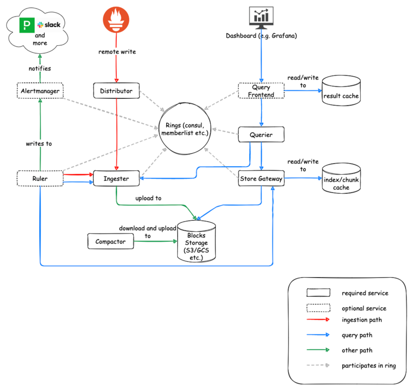

# CORTEX METRICS ARCHITECTURE OVERVIEW

Cortex is primarily used as a [https://prometheus.io/docs/prometheus/latest/configuration/configuration/#remote_write](remote-write) 
destination for Prometheus, exposing a Prometheus-compatible query API.

- **Horizontally scalable**: Cortex can run across multiple machines in a cluster, exceeding the throughput and storage of a single machine.
This enables you to send the metrics from multiple Prometheus servers to a single Cortex cluster and run "globally aggregated" queries
across all data in a single place.
- **Highly available**: When run in a cluster, Cortex can replicate data between machines.
- Multi-tenant: Cortex can isolate data and queries from multiple different independent Prometheus sources in a single cluster,
allowing untrusted parties to share the same cluster.
- Long-term storage: Cortex supports S3, GCS, Swift, and Microsoft Azure for long-term storage of metric data. This allows you
to durably store data for longer than the lifetime of any single machine,

## References:

1. [Deep dive into Cortex](https://medium.com/nerd-for-tech/deep-dive-into-cortex-part-i-c228e01f8c58)
2. [Cortex Architecture](https://cortexmetrics.io/docs/architecture/)
