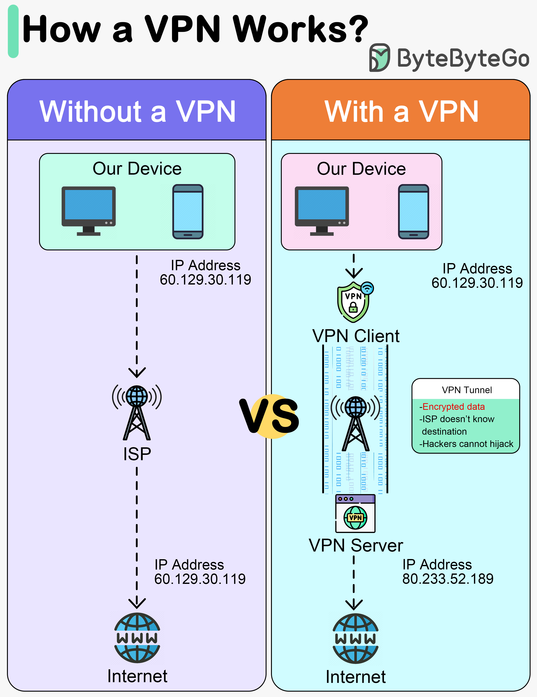

# What is a VPN (Virtual Private Network)?

## What is VPN ?

A VPN creates a secure, private connection between your device and the internet. It protects sensitive company and personal
data - such as files, and payment information - especially when working remotely or using public networks. By masking your IP
address and encrypting your data, a VPN prevents unauthorized access and keeps online activity private.

## What are the benefits of a VPN?

VPN services are primarily used to securely transmit data over the internet.

### Privacy

Without a virtual private network, users' personal data, like passwords, credit card information, and browsing history, 
can be recorded and sold by third parties. VPNs use encryption to keep this confidential information private, especially 
when connecting over public wi-fi networks.

### Anonymity

Any IP address contains information about the user's location and browsing activity. All websites on the Internet track 
this data using cookies and similar technology. They can identify users whenever they visit them. A VPN connection conceals
the user's IP address, enabling them to remain anonymous online.

### Security

A VPN service uses cryptography to protect an internet connection from unauthorized access. It can also act as a shutdown 
mechanism, terminating pre-selected programs in case of suspicious internet activity. This decreases the likelihood of 
data being compromised. These features enable companies to provide remote access to authorized users across their business networks.

### Cost-efficiency

VPNs are a cost-effective, high-speed, and secure way to connect remote users to the office network. Because VPN connections 
are typically established over the public internet, they can be less expensive and offer higher bandwidth as compared to 
dedicated wide-area network (WAN) links or long-distance, remote-dial links.

## What are enterprise use cases of a VPN?

A VPN plays a key role in an organization's network security.

### Quickly scale remote access

VPNs allow organizations to rapidly provide secure access to employees, contractors, and partners. Whether it's a sudden 
shift to remote work or the need to support a globally distributed workforce, VPNs can scale without requiring physical 
infrastructure changes. This ensures that users can access corporate resources from any location while maintaining strict security standards.

### Integrate with mobile authentication systems

VPNs can be seamlessly integrated with enterprise-grade mobile authentication systems, such as multi-factor authentication 
(MFA) or biometrics. This enables businesses to implement robust identity verification policies, ensuring that only authorized 
users can access sensitive resources. It also enhances user experience by enabling secure access through familiar mobile devices 
and enterprise identity providers.

### Control application migrations

VPNs provide a secure and reliable communication channel when migrating applications between environments, such as from 
on-premises data centers to the cloud. Enterprises can maintain access control and data integrity during the transition 
phase, reducing the risk of sensitive data breaches or service disruptions. VPNs also simplify hybrid deployments by 
enabling secure interaction between legacy and cloud-native systems.

### Secure communication between remote locations

Enterprises with multiple offices or remote facilities rely on VPNs to establish encrypted communication links between 
locations. This interconnectivity enables secure data transfer, collaboration, and access to centralized systems without 
the need for expensive leased lines or Multiprotocol Label Switching (MPLS). VPNs help maintain confidentiality and 
compliance across geographically distributed networks.

## What are the use cases for a personal VPN?

### For safe public internet access

Virtual private networks make on-the-go web activity safer for everyone. People today are accustomed to reading news 
articles at the café, checking email at the supermarket, or logging into their bank accounts on mobile devices. This type 
of internet connection is vulnerable because web activity is conducted over public Wi-Fi. Using VPN services when connecting 
to unsecured public wi-fi hotspots keeps both your data and device safe.

### To keep your search history private

Internet service providers and web browsers track search history for marketing purposes.

### For accessing streaming services globally

When you travel outside your home country, your paid streaming services may not be available due to contractual terms 
and regulations. Your VPN connection will enable you to change your IP address to one from a different country and provide 
access to your favorite shows from anywhere.

### For protecting your identity

By keeping you anonymous, VPN services protect you from digital surveillance. They prevent your comments and conversations 
on the Internet from being tracked and safeguard your right to freedom of speech, provided that you do not use your real 
identity on social media platforms.

## How do VPNs work?

A VPN works in 4 steps:

- **Step 1** - Establish a secure tunnel between our device and the VPN server.
- **Step 2** - Encrypt the data transmitted.
- **Step 3** - Mask your IP address, so it appears as if your activity is coming from the VPN server.
- **Step 4** - Our internet traffic is routed through the VPN server.

### Key Components:

#### 1. VPN Client

It encrypts the user's internet traffic and handles the authentication process. The client ensures data privacy by routing
traffic through a secure tunnel, preventing unauthorized access and eavesdropping. The client also selects which VPN protocol
to use based on compatibility and security requirements.

#### 2. VPN Server

The VPN Server is the destination endpoint that receives the client's encrypted traffic. It decrypts the data, enforces access
control policies, and routes the traffic to the appropriate internal resources or internet destinations. The server works
in tandem with the client using VPN protocols to establish and maintain a secure connection.

When you go online, this VPN server becomes the source of all your data. Your Internet Service Provider (ISP) and other 
third parties can no longer see the contents of your internet traffic.

#### 3. VPN protocols

VPN protocols define how data is securely transmitted between the client and the server. Common protocols include OpenVPN, 
IPsec, L2TP, WireGuard, and IKEv2. These protocols determine the level of encryption, connection speed, and reliability. 
The choice of protocol impacts security posture and user experience, with some protocols optimized for mobile use and 
others for high-throughput enterprise environments.

VPN protocols like IPSec scramble your data before sending it through the data tunnel. IPsec is a protocol suite for 
securing Internet Protocol (IP) communications by authenticating and encrypting each IP packet of a data stream.

## References:

1. [What is a VPN (Virtual Private Network)?](https://aws.amazon.com/what-is/vpn/)
2. [How does a VPN work](https://bytebytego.com/guides/how-does-a-vpn-work/)