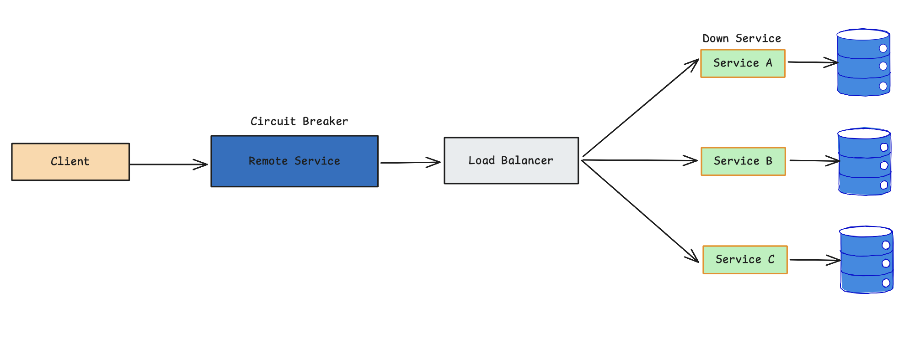
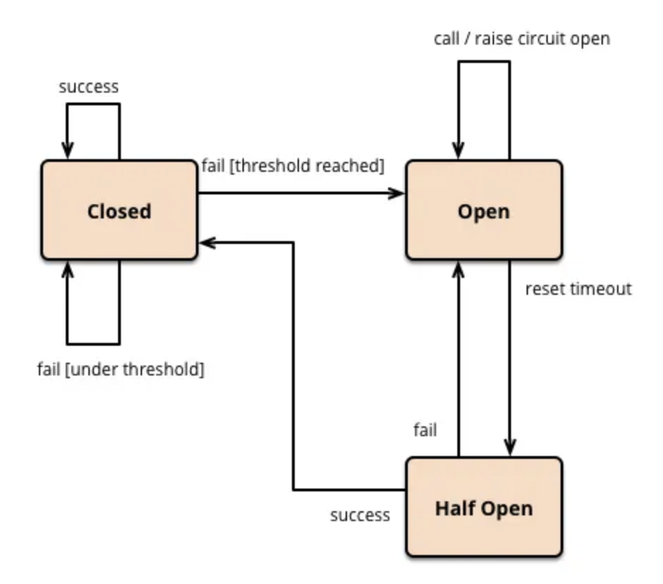

# Circuit Breaker Pattern (Design Pattern for Microservices)

## Circuit Breaker Pattern

The Circuit Breaker design pattern is used to stop the request and response process if a service is not working, as the name suggests.

When the number of failures reaches a certain threshold, the circuit breaker trips for a defined duration of time. During this timeout, any requests to the offline server will fail. When that time period is up, the circuit breaker will allow a limited number of tests to pass, and if those requests are successful, the circuit breaker will return to normal operation. If there is a failure, the time out period will start again.

## What are the causes to break the services?

### Use case 1

In a microservices system, a web server (or API Gateway) uses a limited number of threads to handle incoming requests. Each request is processed by assigning a thread that calls a downstream service and waits for a response.

If one downstream service becomes slow or fails, the threads calling that service are blocked while waiting. This is not a problem when only a few requests are affected. However, if the failing service is a **high-traffic service**, many requests arrive at the same time, causing more and more threads to be allocated and blocked.

Eventually, the thread pool becomes exhausted. When all threads are occupied, new incoming requests cannot be processed and are placed into a queue. The queue grows rapidly, increasing latency and memory usage.

Even if the failed service later recovers, the web server may still not recover. While it is trying to process the large backlog of queued requests, new requests continue to arrive. As a result, the system becomes overwhelmed and may enter a cascading failure, effectively bringing down the entire service.

### Use case 2

**Service A calls B, B calls C, and C calls D**. At the same time, there are other independent services such as **W, X, Y, and Z** running in the system.

If **Service D fails to respond on time** (for example, due to a timeout, crash, or overload), the problem starts at the bottom of the call chain.

- **Service C** waits for Service D’s response.
- Because Service C is blocked, **Service B** must also wait.
- Since Service B is waiting, **Service A** becomes blocked as well.

As a result, a failure in **one downstream service (D)** propagates upward through the call chain, causing **A, B, and C to become unavailable**, even though they are not faulty themselves. This phenomenon is known as **cascading failure**.

Over time, blocked threads, increased latency, and request backlogs can cause these services to go offline, impacting other parts of the system as well.

## Solution with Circuit Breaker pattern

The circuit breaker's basic concept is to wrap a protected function call in a circuit breaker object that monitors for failures. When the number of failures reaches a certain threshold, the circuit breaker trips, and all requests to the circuit breaker return with an error.

The Circuit Breaker pattern has 3 states

**1. Open**

**2. Closed**

**3. Half-Open**

- The circuit breaker works (pass requests through the service) normally when it is in the **"closed"** state. But when the failures exceed the threshold limit, the circuit breaker trips.

- When the circuit is **"open"** incoming requests will return with error without any attempt to execute the real operation.

- After a duration of time, the circuit breaker goes into the **"half-open"** state. In this state, the circuit breaker will allow a limited
number of test requests to pass through and if the requests succeed, the circuit breaker resets and returns to the "closed" state and the traffic will go through as usual. If this request fails, the circuit breaker returns to the open state

### But why not directly go to the service and see. If it’s failing the request can go back. Why is it necessary to have something in between?

- Assume you have a 30 seconds timeout. If each request is trying to reach service A, without considering it failing all the requests which come from the consumer will wait 30 seconds. End of the 30 seconds these requests will timeout.

- During that 30 seconds, the remaining requests that come to consume A will try to reach service A and those are also going and wait in the queue.

- So, what the circuit breaker pattern does is, if the service is failing more than the given threshold, it will not try to reach service A, instead it will fail back to the consumer saying service A is not available.