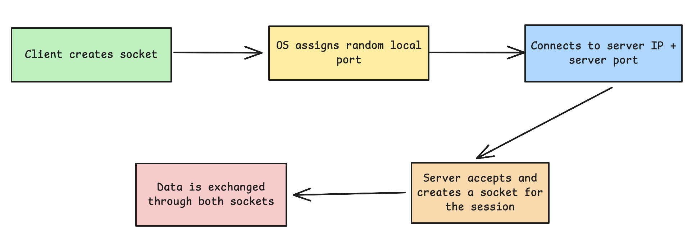

# What is Difference Between a Port and a Socket?

## What is Port?

A port is a logic number assigned to a specific server of application on a machine. It helps the operating system route incoming and outgoing
traffic to the correct process.

Ports are always associated with a protocol like TCP or UDP. For example:

- Port 22 (TCP): SSH
- Port 80 (TCP): HTTP
- Port 443 (TCP): HTTPS
- Port 3306 (TCP): MySQL

Ports range from 0 to 65535. Ports below 1024 are considered _privileged_ and usually require elevated permissions to bind to.

## What is Socker?

A __socket__ is an endpoint for sending or receiving data across a network. It includes more than just the port, it's a combination of several
pieces of information:

```text
<protocol>, <local IP address>, <local port>, <remote IP address>, <remote port>
```

This 5-part combination is often referred to as a __socket tuple__.

For example, a socket might look like this:

```text
TCP, 192.168.1.5, 51734, 93.184.216.34, 80
```

This describes a TCP connection from your local machine on port `51734` to a remote web server (`93.184.216.34`) on port `80`.

A socker presents an actual connection, while a port is just an address that can accept or initiate connections.

## How They Work Together?

When your machine runs a server (like a web app on port 3000), it listens on a specific port. That port doesn't do anything on its own,
it becomes useful when a socket is created, which involves:

- Choosing a local port (like 3000).
- Listening for connections from remote addresses.
- Creating a socket for each new connection.

On the client side, your browser creates a socket with a random local port, connects to the remote IP and port, and establishes a TCP socket.



## Checking Sockets and Ports in Action

- See active sockets with:

```shell
netstat -an | grep ESTABLISHED
```

- To list all ports listened to:

```shell
sudo lsof -nP -iTCP -sTCP:LISTEN
```

### Common Confusion

__1. A port is not a process__. Multiple apps can't listen on the same port at the same time (on the same IP), but many sockets can use the same port if the connections are unique.

Think of it like this:

- __IP address__ -> the building.
- __Port__ -> the apartment number.
- __Process__ -> the person living in the apartment.

The OS maintains a table like:

```ardunio
(IP, port) -> process
```

When a packet arrives, the OS checks:

> "Which process is bound to this IP + port?"

__2. A socket includes the remote side__. That's what makes it a unique connection.

__3. You can't bind two servers to the same port on the same IP__. You'll get an "address already in use" error. 

## References:

1. [Difference between Port and Socket](https://devops-daily.com/posts/difference-between-port-and-socket)
