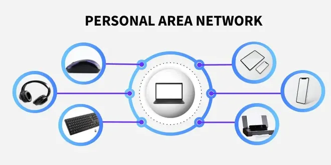
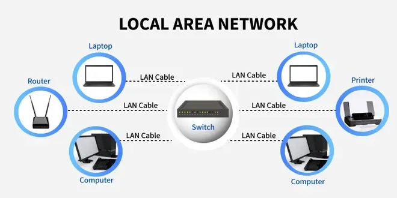
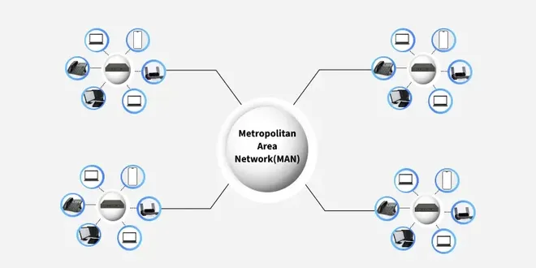
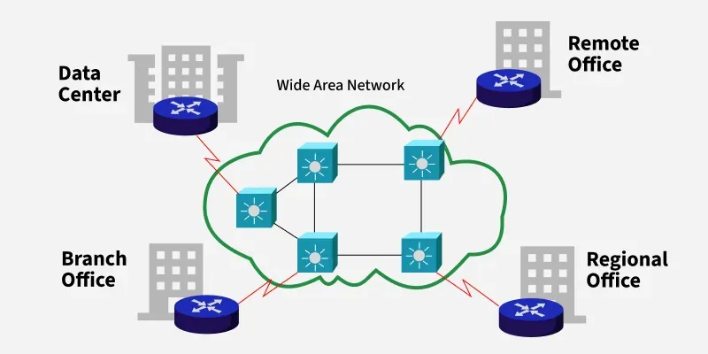
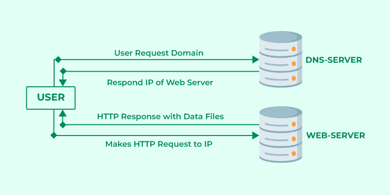
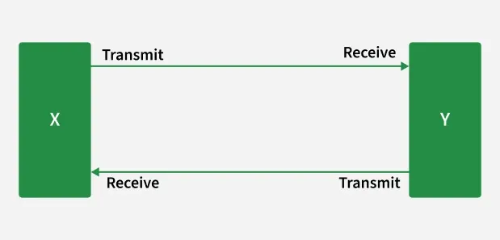
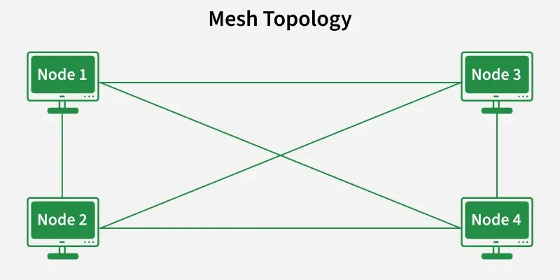
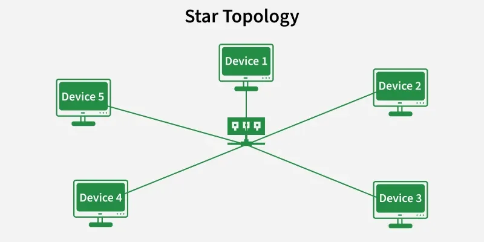
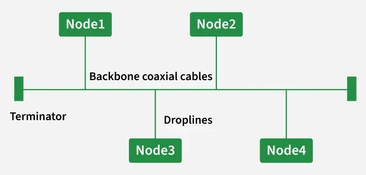

# NETWORKING BASIC

## 1. Introduction to Networking

### 1.1. What is networking?

A computer network is a collection of interconnected devices that share resources and information. These devices can include computers, servers, printers, and other hardware. Networks allow for the efficient exchange of data, enabling various applications such as email, file sharing, and internet browsing.

### 1.2. Types of Network - LAN, WAN, AND MAN

The different types of networks can be categorised based on the area they cover (ranging from personal connections to global networks), the type of communication they use, and their architectural design.

#### Personal Area Network (PAN)

A PAN is a short-range network that connects personal devices like smartphones, tablets, and computers. It typically covers less than 10 meters (about 33 feet) and usually uses wireless technologies such as Bluetooth. PAN is smaller than other networks like LAN or WAN and is mainly used for data sharing between a few devices.

- __Advantages:__

    + Allows for easy communication between personal devices in close proximity.
    + Uses wireless technology, which eliminates the need for wires and cables.
    + PANs are designed to be energy efficient, which means that devices can communicate with each other without draining their batteries quickly.

- __Disadvantages:__

    + Limited coverage area.
    + PANs have limited bandwidth, so they are not suitable for large-scale or high-speed data transfer.
    + May experience interference from other wireless devices.

#### Local Area Network (LAN)

A LAN connects computers and devices within a small area like a home, office, school, or hospital. It usually uses switches, routers, and private IP addresses. LANs are high-speed, inexpensive to set up, and easy to maintain.

- **Coverage:** Up to 2 km (limited area).

- **Speed:** Earlier 4–16 Mbps; now 100–1000 Mbps.

- **Medium:** Mostly wired (Ethernet cables, twisted-pair, coaxial), though wireless can also be used.

- **Example:** Students playing a multiplayer game in the same room without internet.

- **Advantages:**

    + Provides fast data transfer rates and high-speed communication.
    + Easy to set up and manage.
    + Can be used to share peripheral devices such as printers and scanners.

- **Disadvantages:**

    + Limited geographical coverage.
    + Limited scalability and may require significant infrastructure upgrades to accommodate growth.
    + May experience congestion and network performance issues with increased usage.

#### Metropolitan Area Network (MAN)

A MAN spans 5–50 km, covering more area than a LAN but less than a WAN. It connects computers across a city or between nearby cities. MANs provide high-speed connectivity (in Mbps), can act as ISPs, and are useful for organizations needing fast communication. However, they are costly, complex to design, and harder to maintain.

- **Advantages:**

    + Provides high-speed connectivity over a larger geographical area than LAN.
    + Can be used as an ISP for multiple customers.
    + Offers higher data transfer rates than WAN in some cases.

- **Disadvantages:**

    + Can be expensive to set up and maintain.
    + May experience congestion and network performance issues with increased usage.
    + May have limited fault tolerance and security compared to LANs.

#### Wide Area Network (WAN)

A WAN covers large geographical areas (above 50 km), often connecting multiple LANs through telephone lines, radio waves, or satellites. It can be private (for organizations) or public (like the internet). WANs offer high-speed communication but are costly to set up and maintain.

- **Advantages:**

    + Covers large geographical areas and can connect remote locations.
    + Provides connectivity to the internet.
    + Offers remote access to resources and applications.

- **Disadvantages:**

    + Can be expensive to set up and maintain.
    + Offers slower data transfer rates than LAN or MAN.
    + May have lower fault tolerance and security compared to LANs.

### Client-Server Model

The Client-Server Model is a distributed architecture where clients request service and servers provide them. It underpins many modern systems, including websites, email, and cloud storage platforms.

#### How Does the Client-Server Model Work?

**Client:** A client is any device or software that initiates communication by requesting data or services from a server. Common client applications include: Web browsers (e.g., Chrome, Firefox) and Email apps (e.g., Gmail, Outlook).

**Server:** A server is a powerful systems that listens for and responds to client requests by delivering data or performing tasks. Servers often handle multiple simultaneous client requests. Common server applications include: Web Servers (e.g., Apache, Nginx); Email Servers; Database servers

#### How the Browser Interacts With the Servers?

**1. Use Enters the URL (Uniform Resource Locator):** The user types a website address (e.g., www.example.com) into the browser's address bar.

**2. DNS (Domain Name System) Lookup:** The browser contacts a DNS server to convert the domain into an IP address.

**3. Establishing a Connection:** The browser sends an HTTP/HTTPS request to the server using the resolved IP address.

**4. Server Responds:** The server sends back website files (HTML, CSS, JavaScript, images).

**5. Browser Renders the Webpage:**

- **DOM interpreter:** Processes HTML to structure the page.
- **CSS interpreter:** Applies styles
- **JavaScript Engine:** Adds interactivity (using JIT compilation for performance).

#### Advantages of the Client-Server Model

- **Centralized Data Management:** Easy to maintain and back up data.
- **Cost Efficiency:** Clients require less processing power.
- **Scalability:** Servers and clients can scale independently.
- **Security:** Centralized security policies and authentication.
- **Data Recovery:** Easier backup and restore from a single source.

#### Disadvantages of Client-Server Model

- **Client Vulnerability:** Risk of malware if servers distribute unsafe files.
- **Server as a Target:** Susceptible to DDoS (Denial of Service) attacks.
- **Data Spoofing:** Unprotected data can be tampered with in transit.
- **MITM Attacks:** Unsecured connections can be intercepted by attackers.

### Peer-to-Peer Architecture

The P2P process deals with a network structure where any participant in the network knowns as a node acts as both a client and a server. This means that, rather than relying on a basis server to supply resources or services, everybody from the network of nodes can trade resources and services with one another. In a P2P system, every node has an equal role to play and the same functionalities, which means that the loads are well shared.

#### What Is a Peer-to-Peer (P2P) Service?

A peer-to-peer network is a simple network of computers. It first came into existence in the late 1970s. Here each computer acts as a node for file sharing within the formed network. Here each node acts as a server and thus there is no central server in the network. This allows the sharing of a huge amount of data. The tasks are equally divided amongst the nodes. Each node connected in the network shares an equal workload. For the network to stop working, all the nodes need to individually stop working. This is because each node works independently. 

#### Features of P2P Network

- These networks do not involve a large number of nodes, usually less than 12. All the computers in the network store their own data but this data is accessible by the group. 
- Unlike client-server networks, P2P uses resources and also provides them. This results in additional resources if the number of nodes increases. It requires specialized software. It allows resource sharing among the network. 
- Since the nodes act as clients and servers, there is a constant threat of attack. 
- Almost all OS today support P2P networks. 

#### P2P Network Architecture

In the P2P network architecture, the computers connect with each other in a workgroup to share files, and access to internet and printers. 

- Each computer in the network has the same set of responsibilities and capabilities.
- Each device in the network serves as both a client and server.
- The architecture is useful in residential areas, small offices, or small companies where each computer act as an independent workstation and stores the data on its hard drive. 
- Each computer in the network has the ability to share data with other computers in the network.
- The architecture is usually composed of workgroups of 12 or more computers. 

#### How Does P2P Network Work?

Suppose, the user wants to download a file through the peer-to-peer network then the download will be handled in this way:

- If the peer-to-peer software is not already installed, then the user first has to install the peer-to-peer software on his computer.
- This creates a virtual network of peer-to-peer application users.
- The user then downloads the file, which is received in bits that come from multiple computers in the network that have already that file.
- The data is also sent from the user's computer to other computers in the network that ask for the data that exist on the user's computer.

### Types of Network Topology

A network topology is the arrangement of devices (nodes) and connections (links) in a computer network. It shows how computers, servers, and other devices are connected and how data flows between them. There are two main types of topology:

- **Physical Topology:** The actual physical layout of cables and devices.
- **Logical Topology:** How data moves across the network, regardless of physical layout.

> **Note:** Choosing the right topology is important because it affects the performance, cost, reliability, and security of the network.

#### Point To Point Topology

Point-to-point topology is a type of topology that works on the functionality of the sender and receiver. It is the simplest communication between two nodes, in which one is the sender and the other one is the receiver. Point-to-Point provides high bandwidth.

#### Mesh Topology

In a mesh topology, every device is connected to another device via a particular channel. Every device is connected to another via dedicated channels. These channels are known as links. In Mesh Topology, the protocols used are AHCP (Ad Hoc Configuration Protocols), DHCP (Dynamic Host Configuration Protocol), etc.

- **Advantages of Mesh Topology**

    + Communication is very fast between the nodes.
    + Mesh Topology is robust.
    + The fault is diagnosed easily. Data is reliable because data is transferred among the devices through dedicated channels or links.
    + Provides security and privacy.

- **Disadvantages of Mesh Topology**

    + Installation and configuration are difficult.
    + The cost of cables is high as bulk wiring is required, hence suitable for less number of devices.
    + The cost of maintenance is high.

> **Note:** A common example of mesh topology is the internet backbone, where various internet service providers are connected to each other via dedicated channels. This topology is also used in military communication systems and aircraft navigation systems. 

#### Star Topology

In Star Topology, all the devices are connected to a single hub through a cable. This hub is the central node and all other nodes are connected to the central node. The hub can be passive in nature i.e., not an intelligent hub such as broadcasting devices, at the same time the hub can be intelligent known as an active hub. Active hubs have repeaters in them.

#### Bus Topology

Bus Topology is a network type in which every computer and network device is connected to a single cable. It is bi-directional. It is a multi-point connection and a non-robust topology because if the backbone fails the topology crashes. IBus-topology Ethernet uses only the CSMA/CD MAC protocol. TDMA, CDMA, Pure ALOHA, and Slotted ALOHA were never used in Ethernet.

## References:

1. [Basic Computer Networking](https://www.geeksforgeeks.org/computer-networks/basics-computer-networking/)
2. [Type of Network](https://www.geeksforgeeks.org/computer-networks/types-of-area-networks-lan-man-and-wan/)
3. [Client-Server Model](https://www.geeksforgeeks.org/system-design/client-server-model/)
4. [Types of Network Topology](https://www.geeksforgeeks.org/computer-networks/types-of-network-topology/)