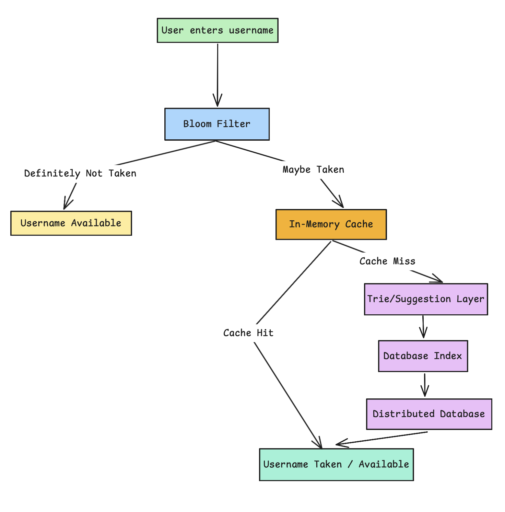
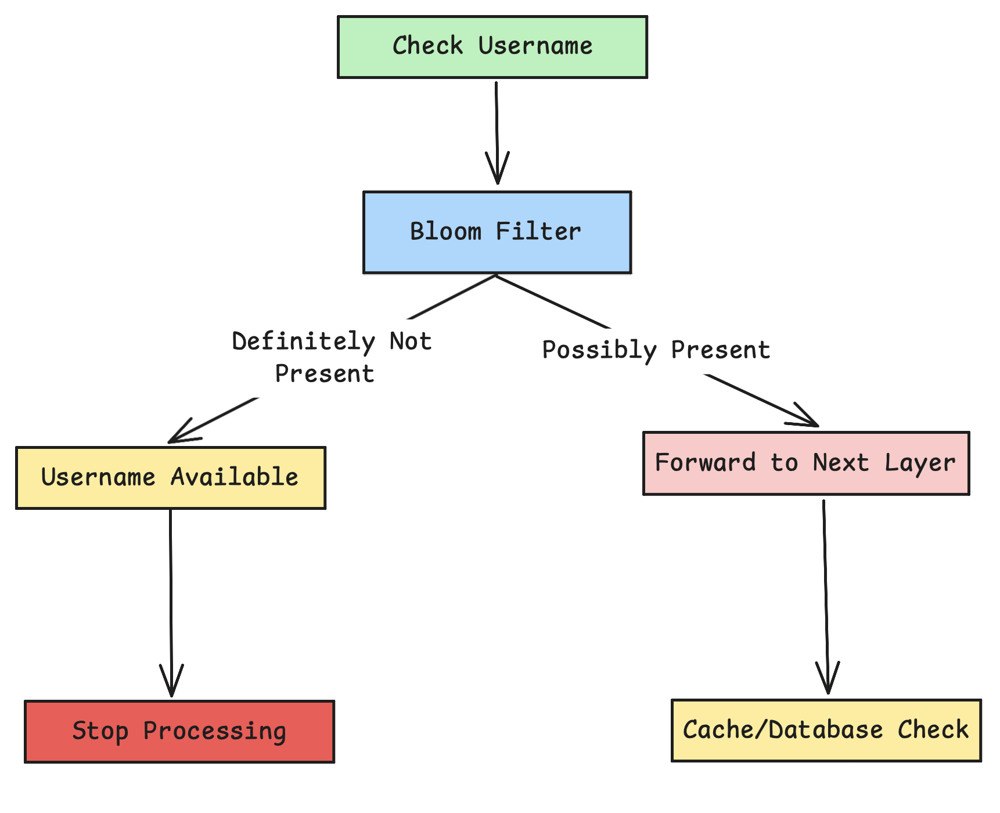

# HOW TO CHECK USERNAME AVAILABILITY IN MILLISECONDS

## High-Level Username Check Flow

## Layer 1: Rejecting Requests Almost Instantly

The first layer doesn't confirm availability. It rejects impossibility. Bloom filters answer one question:

> **"Is this username definitely unavailable?"**

If the answer is yes, the system stops immediately.

Bloom filters are:

- Extremely memory-efficient.
- Fast enough to run millions of times per second.
- Designed to eliminate unnecessary work.

## Layer 2: Memory Beats Recalculation

Layer 2 uses memory (cache) to return previously computed results instead of recalculating them.
Because many requests are repeated, in-memory caches can respond extremely fast (milliseconds or even microseconds).

This layer helps the system:
- Absorb traffic spikes
- Avoid duplicate work
- Protect slower components like databases or external services

Caches don’t need to be perfectly accurate — their main goal is **speed**.

## Layer 3: Why Suggestions Feel Instant

When you try to register a username and it’s already taken, the system can instantly suggest similar alternatives. This works because the system doesn’t search for exact matches — it searches by **prefix**.

A **Trie** (prefix tree) is a data structure designed for this purpose. It stores data character by character, which allows the system to:

- Traverse usernames one letter at a time.
- Quickly find all entries that share the same prefix.
- Generate suggestions with very low latency.

Tries trade **higher memory usage** for **fast response times**, so they are used selectively, usually for user-facing features.

## Layer 4: Precision Lives Here

When speed-focused shortcuts like cache or memory are no longer enough, databases provide the exact truth.
Indexed structures such as B+ trees enable precise lookups, durable storage, and predictable performance.

Although slower than memory, databases are reliable and act as the source of truth, which is why this layer is protected behind services and not directly exposed.

## Layer 5: The Final Authority

At global scale, the source of truth must be distributed.
Usernames are sharded across regions and heavily replicated to ensure availability and fault tolerance.

Distributed databases serve as the final authority.
They are highly reliable but costly, so systems access them only when necessary.